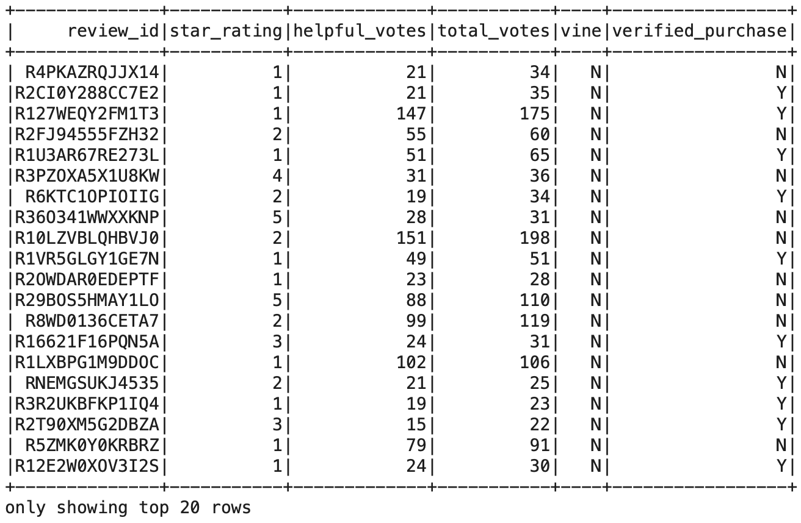
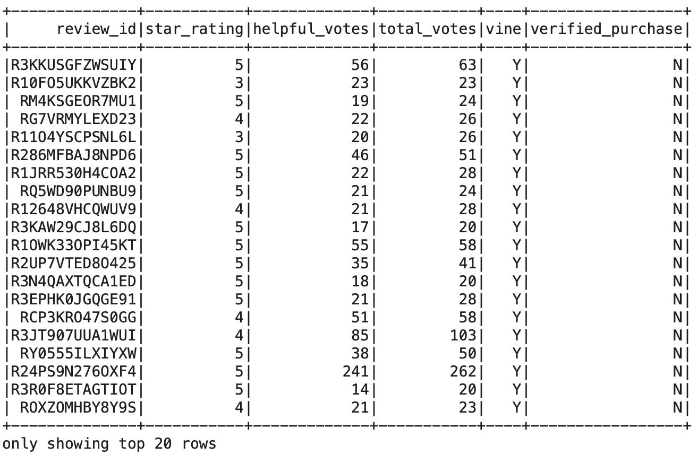
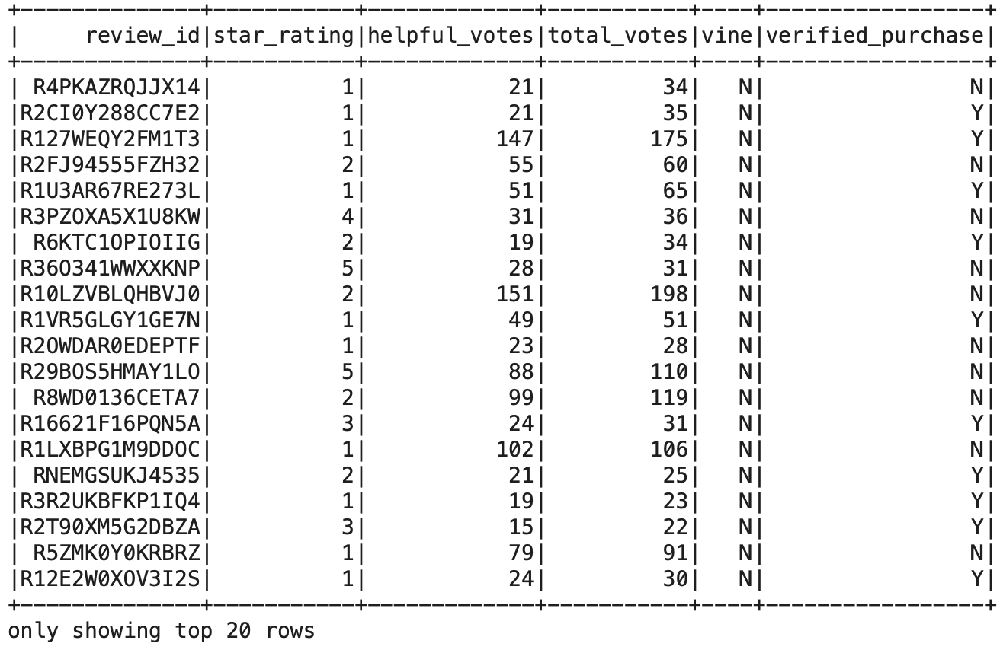
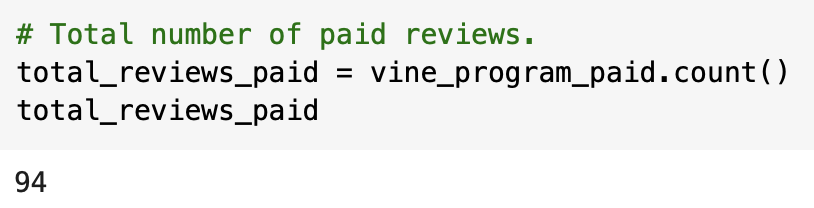
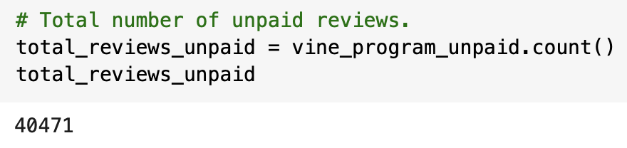
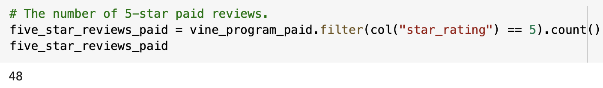
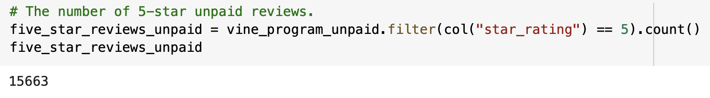
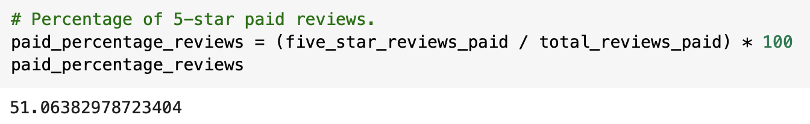
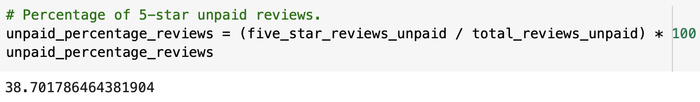

# Amazon_Vine_Analysis

## Overview of Analysis

In this project, we are required to analyze Amazon reviews that have been written by members of the paid Amazon Vine program which is a program that lets manufacturers and publishers to recieve reviews for their products. 

### Purpose

The purpose of this project is to select one dataset from [Amazon Review Datasets] which contains reviews of a specific product for performing the ETL process using PySpark by extracting the dataset, transforming the data,connecting to an Amazon Web Services RDS instance and loading the transformed data into pgAdmin. Additionally, we are required to utilIZE PySpark for identifying if there is any bias present toward favorable reviews from Vine members within the chosen dataset.

## Results

In this section of the project, PySpark was used for extracting the Video Games dataset from the Amazon review Datasets into a DataFrame. Furthermore, **vine_table** was then created which included the information on the vine and non-vine reviews. As a result of this, we were required to create new DataFrames by applying by filtering the reviews to those with more than 20 total votes and those than were 50% helpful as shown in figure below.

Additionally, the DataFrame shown abovbe was further filtered for displaying the vine and non-vine reviews as illusratered respectively in the figures below. This was done for determining the total number of reviews, the number of 5-star reviews, and the percentage of 5-star reviews for the both vine and non-vine reviews. By this way we will be able to determine if having a paid Vine review a difference in the percentage of 5-star reviews.

*Vine Reviews DataFrame*

 

*Non-Vine Reviews DataFrame*

### Total Number of Reviews

The total number of vine and non-vine reviews were found to be as follows:

 - There were **94** total number of Vine reviews.

 
 
 - There were **40,471** total number of non-Vine reviews.

### Number of 5-star Reviews

The number of 5-star Vine and non-Vine reviews were as follows:

- There were **48** 5-star Vine reviews.

 

- There were **15,663** 5-star non-Vine reviews.

### Percentage of 5-star Reviews

The percentage of 5-star Vine and non-Vine reviews were as follows:

- **51.06%** of 5-star reviews were Vine.

- **38.70%** of 5-star reviews were non-Vine.

## Summary

Looking at the percentage of reviews, it was found that **51.06%** of Amazon reviews that were part of vine program gave a 5-star rating, whereas the percentage of non-Vine 5-star reviews were **38.70%**. Taking these results into account, it can be clearly said that there is a possibility of positive bias for reviews in the Vine program.

Additionally, the statistical distribution of the star_rating column for both the vine and non-vine reviews can be performed by analyzing the mean, median and mode for further supporting the aforementioned statement.
